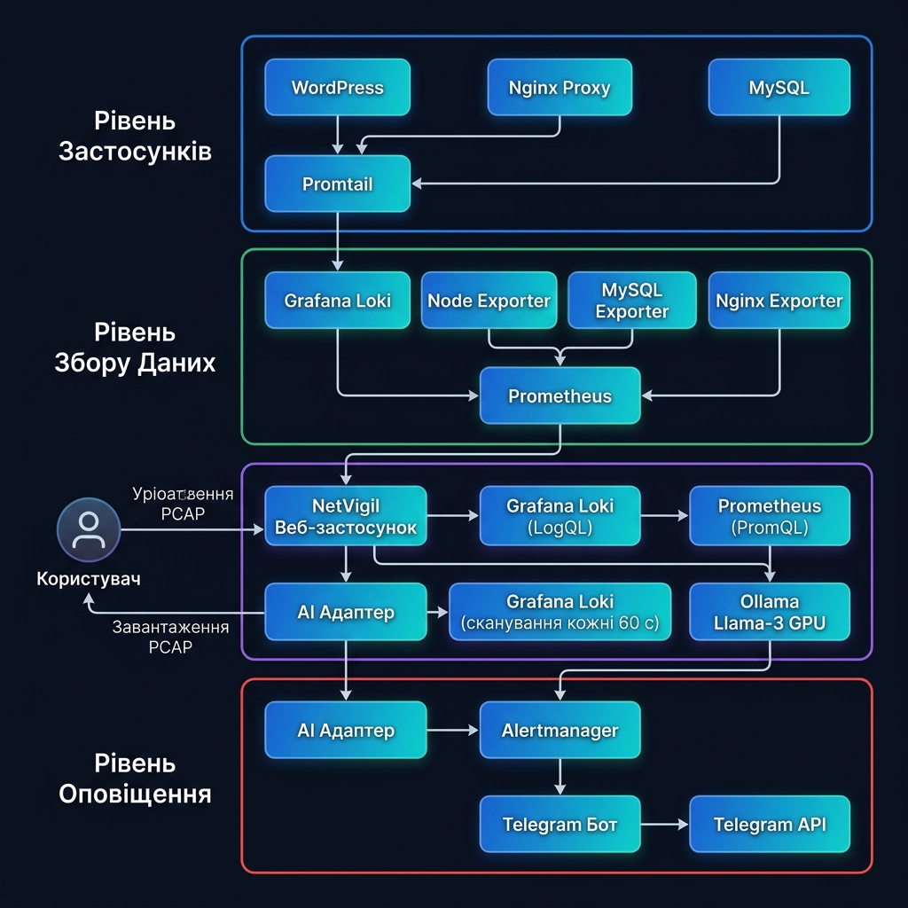
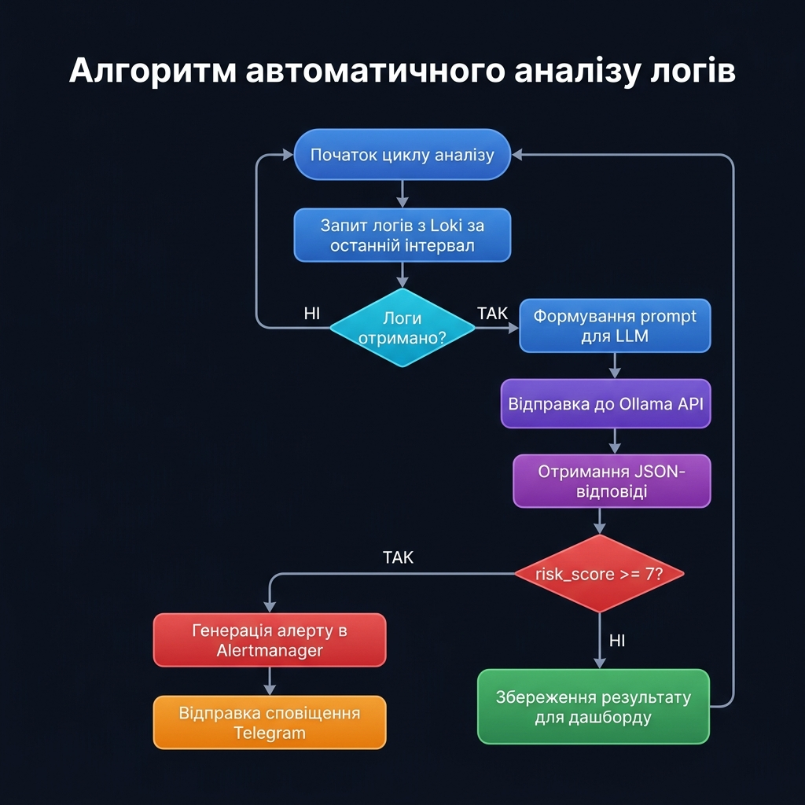
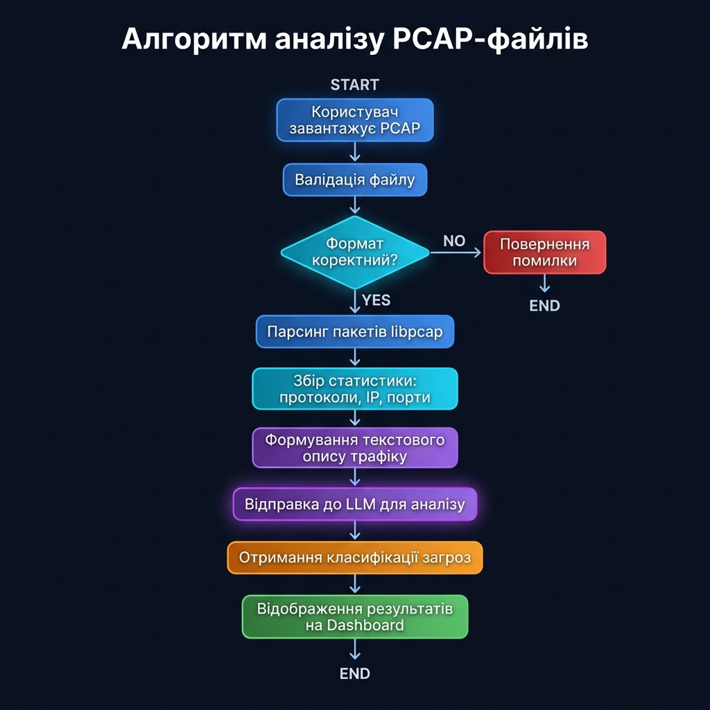
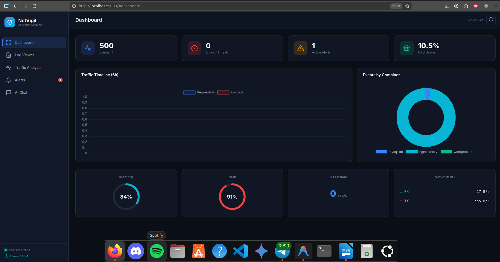
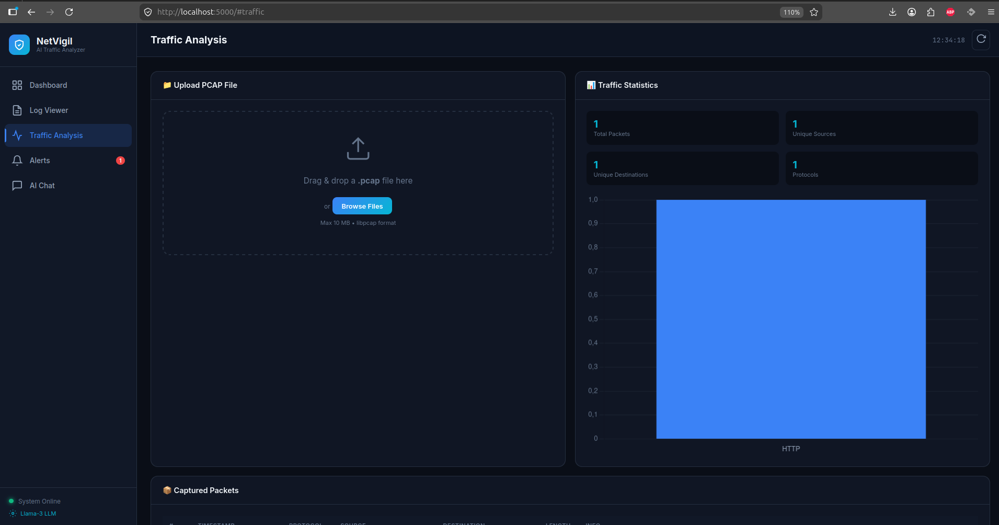
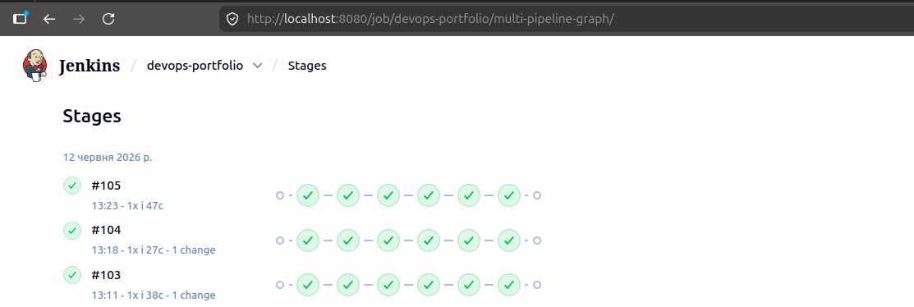
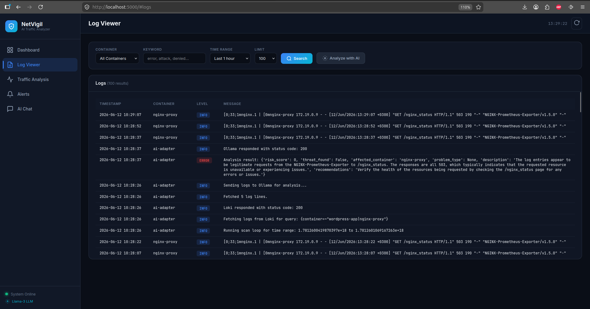
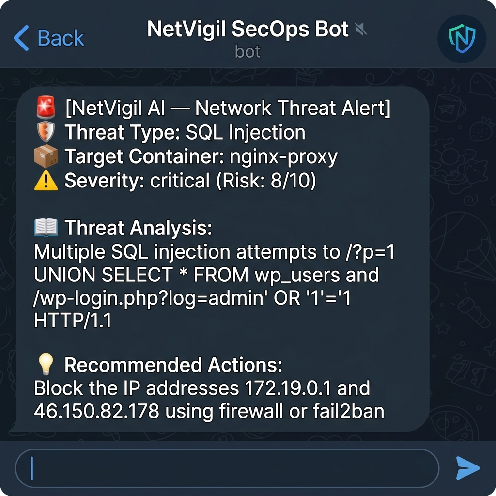
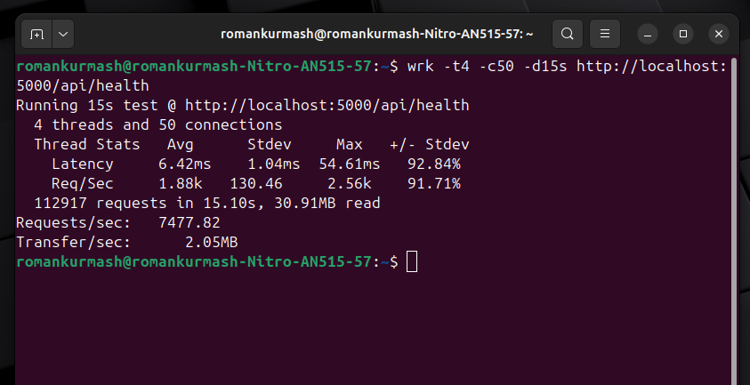

МІНІСТЕРСТВО ОСВІТИ І НАУКИ УКРАЇНИ

НАЦІОНАЛЬНИЙ УНІВЕРСИТЕТ БІОРЕСУРСІВ І ПРИРОДОКОРИСТУВАННЯ УКРАЇНИ

ВІДОКРЕМЛЕНИЙ СТРУКТУРНИЙ ПІДРОЗДІЛ «РІВНЕНСЬКИЙ ФАХОВИЙ КОЛЕДЖ НАЦІОНАЛЬНОГО УНІВЕРСИТЕТУ БІОРЕСУРСІВ І ПРИРОДОКОРИСТУВАННЯ УКРАЇНИ»

Відділення інформаційних технологій

Циклова комісія програмування та інформаційних дисциплін


ПОЯСНЮВАЛЬНА ЗАПИСКА

до дипломної роботи
фахового молодшого бакалавра

на тему «ВЕБДОДАТОК З ВИКОРИСТАННЯМ LLM ДЛЯ АНАЛІЗУ МЕРЕЖЕВОГО ТРАФІКУ»

125 Кібербезпека
125 Кібербезпека та захист інформації
Галузь знань 12 Інформаційні технології
Освітньо-професійний ступінь «Фаховий молодший бакалавр»


Виконав:
студент 4 курсу, групи 41-К
галузі знань 12 Інформаційні технології
спеціальності 125 Кібербезпека та захист інформації
Курмаш Роман Володимирович

Керівник: Павловський Тарас Мирославович

Рецензент: Якимчук Ірина Олександрівна

Нормоконтролер: ________________________________

Завідувач відділення ІТ: І. О. Якимчук


Рівне – 2026 рік


<div style="page-break-after: always;"></div>

МІНІСТЕРСТВО ОСВІТИ І НАУКИ УКРАЇНИ
НАЦІОНАЛЬНИЙ УНІВЕРСИТЕТ БІОРЕСУРСІВ І ПРИРОДОКОРИСТУВАННЯ УКРАЇНИ
ВІДОКРЕМЛЕНИЙ СТРУКТУРНИЙ ПІДРОЗДІЛ «РІВНЕНСЬКИЙ ФАХОВИЙ КОЛЕДЖ НАЦІОНАЛЬНОГО УНІВЕРСИТЕТУ БІОРЕСУРСІВ І ПРИРОДОКОРИСТУВАННЯ УКРАЇНИ»

Відділення інформаційних технологій
Циклова комісія програмування та інформаційних дисциплін
Освітньо-професійний ступінь: фаховий молодший бакалавр
Галузь знань: 12 Інформаційні технології
Спеціальність: 125 Кібербезпека та захист інформації
Освітньо-професійна програма: Кібербезпека та захист інформації

ЗАТВЕРДЖУЮ
Голова циклової комісії
_______ Павло СТРИК
__________ 2026 року

ЗАВДАННЯ
НА ДИПЛОМНУ РОБОТУ СТУДЕНТУ

Курмашу Роману Володимировичу

1. Тема роботи: «Вебдодаток з використанням LLM для аналізу мережевого трафіку»

керівник роботи: Павловський Тарас Мирославович,
затверджені наказом вищого навчального закладу від _________ 2026 року № ____

2. Термін подання студентом роботи: ____________________

3. Вихідні дані до роботи:
Розробити вебдодаток для аналізу мережевого трафіку з використанням великої мовної моделі (LLM). Система повинна забезпечувати збір логів з мережевих пристроїв та контейнерів, їх аналіз за допомогою моделі Llama-3, виявлення кіберзагроз у реальному часі, а також надавати інтерактивний веб-інтерфейс для візуалізації результатів та взаємодії з AI-асистентом з кібербезпеки. Підтримка завантаження та аналізу PCAP-файлів.

4. Зміст розрахунково-пояснювальної записки (перелік питань, які потрібно розробити):
- Аналіз предметної області: дослідження існуючих методів аналізу мережевого трафіку, огляд IDS/IPS систем, роль LLM у кібербезпеці
- Проектування архітектури системи: мікросервісна архітектура, моделі загроз, алгоритми аналізу
- Реалізація вебдодатку: Flask API, SPA Dashboard, інтеграція з Ollama/Llama-3, парсер PCAP
- Тестування та дослідна експлуатація: функціональне, безпекове та навантажувальне тестування

5. Перелік графічного матеріалу:
- Архітектурна діаграма системи
- Діаграма потоку даних (DFD)
- UML-діаграми послідовності аналізу трафіку
- Скріншоти інтерфейсу вебдодатку
- Модель загроз STRIDE
- Діаграма розгортання Docker-контейнерів

[Консультанти розділів роботи (формат Excel/XLSX)](xlsx/consultants.xlsx)

[Календарний план (формат Excel/XLSX)](xlsx/calendar_plan.xlsx)

Дата видачі завдання ____________ 2026 р.

Здобувач освіти _________ Роман КУРМАШ

Керівник роботи _________ Тарас ПАВЛОВСЬКИЙ


<div style="page-break-after: always;"></div>

# РЕФЕРАТ

Пояснювальна записка до дипломної роботи на тему «Вебдодаток з використанням LLM для аналізу мережевого трафіку» на здобуття освітньо-професійного ступеня «Фаховий молодший бакалавр» зі спеціальності 125 «Кібербезпека та захист інформації» галузі знань 12 «Інформаційні технології» написана на 65 сторінках і містить 12 ілюстрацій, 6 таблиць, 20 джерел за переліком посилань та 2 додатки.

**Мета роботи** — розробити вебдодаток для автоматизованого аналізу мережевого трафіку з використанням великої мовної моделі (LLM) Llama-3, здатний виявляти кіберзагрози в реальному часі та надавати інтерактивний інтерфейс для фахівців з кібербезпеки.

**Об'єкт дослідження** — процес аналізу мережевого трафіку та виявлення кіберзагроз у корпоративному середовищі.

**Предмет дослідження** — методи та засоби розробки вебдодатку для інтелектуального аналізу мережевого трафіку з використанням великих мовних моделей.

**Методи дослідження** базуються на технологіях Python (Flask), JavaScript, контейнеризації Docker, використанні локальної LLM Llama-3 через платформу Ollama з апаратним прискоренням GPU, системі збору логів Grafana Loki та Promtail, моніторингу Prometheus, а також бібліотеці Chart.js для візуалізації даних. Для аналізу мережевих дампів реалізовано парсер формату PCAP (libpcap).

**Практичне значення одержаних результатів** полягає у створенні функціонального вебдодатку NetVigil, який інтегрується з існуючою інфраструктурою моніторингу та забезпечує:
- автоматичне виявлення 10 категорій кіберзагроз у мережевому трафіку за допомогою LLM;
- інтерактивний дашборд для візуалізації стану безпеки в реальному часі;
- аналіз завантажених PCAP-файлів з класифікацією загроз;
- чат-інтерфейс для діалогу з AI-асистентом з кібербезпеки;
- інтеграцію із системою автоматичного сповіщення через Telegram.

Система може бути впроваджена в навчальному закладі для моніторингу безпеки комп'ютерної мережі та використана як навчальний інструмент для підготовки фахівців з кібербезпеки.

**Ключові слова:** КІБЕРБЕЗПЕКА, МЕРЕЖЕВИЙ ТРАФІК, LLM, ВЕЛИКА МОВНА МОДЕЛЬ, ВЕБДОДАТОК, АНАЛІЗ ЗАГРОЗ, PCAP, IDS, МАШИННЕ НАВЧАННЯ, DOCKER, FLASK, OLLAMA, LLAMA-3.


<div style="page-break-after: always;"></div>

# ЗМІСТ

ВСТУП .................................................................................................................. 3

РОЗДІЛ 1. АНАЛІЗ ПРЕДМЕТНОЇ ОБЛАСТІ ДОСЛІДЖЕННЯ. ТЕХНІЧНЕ ЗАВДАННЯ ......... 6

1.1. Огляд предметної області та об'єкта захисту ........................................... 6

1.2. Аналіз існуючих загроз мережевого трафіку ............................................ 8

1.3. Огляд існуючих рішень для аналізу трафіку ............................................. 10

1.4. Роль великих мовних моделей у кібербезпеці .......................................... 12

1.5. Обґрунтування вибору технологій ............................................................ 14

1.6. Технічне завдання ...................................................................................... 16

РОЗДІЛ 2. ПРОЕКТУВАННЯ СИСТЕМИ ЗАХИСТУ .................................................... 18

2.1. Архітектура системи .................................................................................. 18

2.2. Модель загроз (STRIDE) ........................................................................... 20

2.3. Алгоритми аналізу трафіку за допомогою LLM ...................................... 22

2.4. Проектування веб-інтерфейсу .................................................................. 24

2.5. Проектування бази знань загроз ............................................................... 26

РОЗДІЛ 3. РЕАЛІЗАЦІЯ ПРОЕКТУ .......................................................................... 28

3.1. Технологічний стек .................................................................................... 28

3.2. Реалізація серверної частини (Flask API) ................................................... 30

3.3. Реалізація клієнтської частини (SPA Dashboard) ..................................... 33

3.4. Інтеграція з LLM (Ollama/Llama-3) .......................................................... 35

3.5. Модуль аналізу PCAP-файлів ................................................................... 37

3.6. CI/CD Pipeline (Jenkins) ............................................................................. 39

РОЗДІЛ 4. ТЕСТУВАННЯ ТА ДОСЛІДНА ЕКСПЛУАТАЦІЯ ......................................... 41

4.1. Методика тестування ................................................................................. 41

4.2. Функціональне тестування ........................................................................ 42

4.3. Тестування безпеки .................................................................................... 44

4.4. Навантажувальне тестування ..................................................................... 46

4.5. Аналіз результатів ..................................................................................... 48

4.6. Рекомендації щодо вдосконалення ........................................................... 50

ВИСНОВКИ .......................................................................................................... 52

СПИСОК ВИКОРИСТАНИХ ДЖЕРЕЛ ...................................................................... 54

ДОДАТКИ ............................................................................................................. 56

Додаток А. Технічне завдання .......................................................................... 56

Додаток Б. Вихідний код ключових модулів ................................................... 60


<div style="page-break-after: always;"></div>

# ПЕРЕЛІК СКОРОЧЕНЬ ТА УМОВНИХ ПОЗНАЧЕНЬ

[Перелік скорочень та умовних позначень (формат Excel/XLSX)](xlsx/abbreviations.xlsx)


<div style="page-break-after: always;"></div>

# ВСТУП

Стрімкий розвиток інформаційних технологій та цифрова трансформація всіх галузей економіки призвели до значного збільшення обсягу мережевого трафіку в корпоративних та освітніх мережах. Разом із зростанням обсягів даних суттєво зросла кількість та складність кіберзагроз. За даними звіту IBM X-Force Threat Intelligence Index 2024, середня вартість одного кіберінциденту для організації досягла 4,45 мільйона доларів США, а кількість виявлених нових вразливостей у порівнянні з попереднім роком зросла на 12%. Це робить питання моніторингу та аналізу мережевого трафіку одним із пріоритетних завдань сучасної кібербезпеки.

Традиційні системи виявлення вторгнень (IDS), такі як Snort, Suricata та Zeek, базуються переважно на сигнатурному підході — порівнянні мережевого трафіку з відомими шаблонами атак. Цей метод є ефективним для виявлення відомих загроз, проте має суттєві обмеження: нездатність розпізнавати нові (zero-day) атаки, високий рівень хибно-позитивних спрацювань та відсутність контекстуального розуміння змісту трафіку. Зростання кількості та складності кіберзагроз вимагає застосування інтелектуальних методів аналізу, здатних працювати з неструктурованими даними.

Останніми роками великі мовні моделі (LLM — Large Language Models) продемонстрували значний прогрес у задачах обробки природної мови, класифікації, узагальнення та генерації тексту. Моделі, такі як GPT-4, Llama-3, Mistral та Claude, здатні аналізувати текстові дані, виявляти паттерни та надавати пояснення до виявлених аномалій людською мовою. Це відкриває нові можливості для застосування LLM у сфері кібербезпеки, зокрема для аналізу мережевого трафіку, лог-файлів та виявлення підозрілої активності.

**Актуальність теми** дипломної роботи обумовлена необхідністю створення сучасних інструментів для аналізу мережевого трафіку, які поєднують переваги традиційних систем моніторингу з інтелектуальними можливостями LLM. Розроблений вебдодаток дозволяє суттєво скоротити час на виявлення та розслідування кіберінцидентів (MTTR — Mean Time to Resolution), забезпечуючи автоматичну класифікацію загроз та генерацію рекомендацій щодо їх нейтралізації.

**Мета роботи** — розробити вебдодаток для автоматизованого аналізу мережевого трафіку з використанням великої мовної моделі (LLM) Llama-3, який забезпечує виявлення кіберзагроз у реальному часі та надає інтерактивний інтерфейс для фахівців з кібербезпеки.

Для досягнення поставленої мети необхідно вирішити такі **завдання**:

1. Провести аналіз існуючих методів та засобів аналізу мережевого трафіку, визначити їх переваги та обмеження.
2. Дослідити можливості застосування великих мовних моделей для задач кібербезпеки.
3. Спроектувати мікросервісну архітектуру системи з інтеграцією LLM, системи моніторингу та збору логів.
4. Розробити серверну частину вебдодатку (REST API) на базі Python/Flask з модулями аналізу логів, PCAP-файлів та чат-інтерфейсу.
5. Розробити клієнтську частину — інтерактивний SPA Dashboard для візуалізації результатів аналізу.
6. Реалізувати парсер PCAP-файлів для аналізу мережевих дампів.
7. Провести тестування системи, включаючи імітацію кібератак.

**Об'єкт дослідження** — процес аналізу мережевого трафіку та виявлення кіберзагроз у корпоративному та освітньому середовищі.

**Предмет дослідження** — методи та засоби розробки вебдодатку для інтелектуального аналізу мережевого трафіку з використанням великих мовних моделей.

**Методи дослідження:** аналіз літературних джерел; порівняльний аналіз існуючих рішень; моделювання загроз за методологією STRIDE; проектування за принципами мікросервісної архітектури; експериментальне тестування з імітацією мережевих атак; статистичний аналіз результатів.

**Практичне значення** роботи полягає у створенні функціонального вебдодатку NetVigil, який може бути впроваджений у навчальному закладі для моніторингу безпеки комп'ютерної мережі та використаний як навчальний інструмент для підготовки фахівців з кібербезпеки. Система побудована на базі відкритого програмного забезпечення та може бути адаптована для організацій будь-якого масштабу.


<div style="page-break-after: always;"></div>

# РОЗДІЛ 1. АНАЛІЗ ПРЕДМЕТНОЇ ОБЛАСТІ ДОСЛІДЖЕННЯ. ТЕХНІЧНЕ ЗАВДАННЯ

## 1.1. Огляд предметної області та об'єкта захисту

Мережевий трафік — це потік даних, що передається між пристроями в комп'ютерній мережі. Він включає HTTP/HTTPS-запити, DNS-запити, поштові повідомлення, VPN-з'єднання, трафік баз даних та інші протоколи. Аналіз мережевого трафіку є ключовим компонентом забезпечення кібербезпеки організації, оскільки дозволяє виявляти підозрілу активність, несанкціонований доступ та кібератаки.

Об'єктом захисту у цій роботі виступає мережева інфраструктура, побудована на базі контейнерної технології Docker. Інфраструктура включає:

- **Веб-сервер Nginx Proxy** — зворотний проксі-сервер, що обробляє вхідні HTTP/HTTPS-запити та маршрутизує їх до внутрішніх сервісів;
- **Веб-додаток WordPress** — система управління контентом, яка генерує значний обсяг HTTP-трафіку та є типовою мішенню для кібератак;
- **СУБД MySQL** — сервер баз даних, доступ до якого має бути обмежений та контрольований;
- **Система моніторингу Prometheus** — збір метрик продуктивності з експортерів;
- **Система логування Grafana Loki + Promtail** — централізований збір та зберігання логів усіх контейнерів;
- **AI-адаптер** — фоновий мікросервіс для автоматичного аналізу логів;
- **Telegram Bot** — сервіс сповіщень про інциденти безпеки.

Дана інфраструктура є типовою для малих та середніх організацій і представляє повний цикл: від генерації мережевого трафіку (веб-додаток) до його моніторингу та аналізу.

### Характеристика інформаційних активів

[Таблиця 1.1 — Інформаційні активи системи (формат Excel/XLSX)](xlsx/info_assets.xlsx)

## 1.2. Аналіз існуючих загроз мережевого трафіку

Класифікація кіберзагроз мережевого трафіку охоплює широкий спектр атак, які можна розділити на кілька категорій.

### Зовнішні загрози

1. **SQL Injection (SQLi)** — впровадження шкідливого SQL-коду через вхідні параметри веб-додатку. За даними OWASP Top 10 (2021), ін'єкції залишаються однією з найбільш критичних вразливостей.

2. **Cross-Site Scripting (XSS)** — впровадження шкідливих скриптів у веб-сторінки, які виконуються у браузері жертви. Дозволяє викрадати сесійні токени та облікові дані.

3. **Brute-force Attack** — автоматизований перебір паролів для отримання несанкціонованого доступу до системи. Типово спрямований на адміністративні панелі (wp-login.php, wp-admin).

4. **Remote Code Execution (RCE)** — віддалене виконання коду на сервері через вразливості у програмному забезпеченні.

5. **DDoS-атаки** — розподілена відмова в обслуговуванні шляхом генерації надмірного обсягу мережевого трафіку.

6. **DNS Tunneling** — використання DNS-протоколу для прихованої передачі даних за межі мережі.

### Внутрішні загрози

1. **Несанкціонований доступ** — спроби доступу до ресурсів без відповідних привілеїв.
2. **Data Exfiltration** — витік конфіденційних даних за межі організації.
3. **Resource Exhaustion** — вичерпання ресурсів системи (CPU, RAM, диск) внаслідок некоректної роботи або шкідливої активності.

### Технічні загрози

1. **Database Connection Failure** — відмова з'єднання з базою даних, що може свідчити про атаку або збій конфігурації.
2. **Service Timeout** — тайм-аут сервісів, потенційно спричинений навантажувальними атаками.
3. **High Error Rate** — аномально високий рівень помилок, що може бути індикатором сканування вразливостей.

## 1.3. Огляд існуючих рішень для аналізу трафіку

### Сигнатурні системи (IDS/IPS)

**Snort** — одна з найвідоміших IDS/IPS систем з відкритим вихідним кодом. Використовує правила (сигнатури) для виявлення відомих атак у мережевому трафіку. Переваги: висока швидкість, велика база правил. Недоліки: нездатність виявляти zero-day атаки, необхідність ручного оновлення правил.

**Suricata** — багатопотокова IDS/IPS з підтримкою аналізу прикладного рівня (Application Layer). Підтримує сигнатури Snort та власні правила. Переваги: висока продуктивність завдяки багатопоточності. Недоліки: складність налаштування, обмежений контекстний аналіз.

**Zeek (Bro)** — фреймворк для моніторингу мережевої безпеки. На відміну від Snort/Suricata, Zeek фокусується на аналізі метаданих з'єднань та генерації структурованих логів. Переваги: глибокий аналіз протоколів. Недоліки: не є IDS у класичному розумінні, потребує додаткових інструментів для виявлення загроз.

### AI-based рішення

**Darktrace** — комерційна платформа, що використовує алгоритми машинного навчання для виявлення аномалій у мережевому трафіку. Концепція «Enterprise Immune System». Переваги: адаптивність, виявлення невідомих загроз. Недоліки: висока вартість ліцензії, закритий код.

**Vectra AI** — платформа для виявлення та реагування на загрози (NDR). Використовує AI для кореляції подій та пріоритезації загроз. Переваги: автоматизована пріоритезація. Недоліки: вимагає значних ресурсів, комерційна ліцензія.

### SIEM-системи

**ELK Stack (Elasticsearch, Logstash, Kibana)** — відкрита платформа для збору, зберігання та візуалізації логів. Переваги: гнучкість, масштабованість. Недоліки: ресурсоємність, відсутність вбудованого AI-аналізу.

**Grafana Loki** — легковага система збору логів від Grafana Labs. На відміну від Elasticsearch, Loki індексує лише метадані (labels), а не весь вміст логів, що значно зменшує вимоги до ресурсів. Саме ця система використовується у розроблюваному вебдодатку.

[Таблиця 1.2 — Порівняльний аналіз існуючих рішень (формат Excel/XLSX)](xlsx/solutions_comparison.xlsx)

## 1.4. Роль великих мовних моделей у кібербезпеці

Великі мовні моделі (LLM) — це нейромережі-трансформери, навчені на великих обсягах текстових даних. У контексті кібербезпеки LLM мають кілька ключових переваг:

1. **Контекстуальне розуміння** — LLM здатні аналізувати текстові логи та мережеві дані з урахуванням контексту, виявляючи паттерни, які пропускають сигнатурні системи.

2. **Класифікація загроз** — модель може автоматично класифікувати виявлені загрози за типом (SQLi, XSS, Brute-force тощо) та визначати рівень ризику.

3. **Генерація рекомендацій** — LLM формує конкретні рекомендації щодо нейтралізації загрози людською мовою, що скорочує час реагування.

4. **Адаптивність** — на відміну від жорстких сигнатурних правил, LLM може адаптуватися до нових типів атак без необхідності ручного оновлення правил.

У розроблюваній системі використовується модель **Llama-3 (8B)** від Meta AI, яка запускається локально через платформу Ollama з апаратним прискоренням на GPU. Це забезпечує:
- повну конфіденційність — дані не передаються зовнішнім сервісам;
- низьку затримку — інференс виконується локально;
- відсутність обмежень на кількість запитів;
- незалежність від Інтернет-з'єднання.

## 1.5. Обґрунтування вибору технологій

На основі проведеного аналізу обрано наступний технологічний стек:

- **Python 3.11 + Flask** — серверна частина вебдодатку (REST API);
- **HTML5 + CSS3 + JavaScript (ES6+)** — клієнтська частина (SPA Dashboard);
- **Chart.js** — бібліотека для побудови інтерактивних графіків;
- **Ollama + Llama-3** — локальна LLM для аналізу трафіку;
- **Grafana Loki + Promtail** — збір та зберігання логів;
- **Prometheus** — збір метрик;
- **Alertmanager** — управління сповіщеннями;
- **Docker + Docker Compose** — контейнеризація та оркестрація;
- **Jenkins** — CI/CD pipeline;
- **Gunicorn** — WSGI-сервер для production.

## 1.6. Технічне завдання

### 1.6.1. Найменування та область застосування

Вебдодаток «NetVigil» призначений для автоматизованого аналізу мережевого трафіку з використанням LLM в організаціях малого та середнього масштабу, навчальних закладах та IT-компаніях.

### 1.6.2. Функціональні вимоги

1. Збір та відображення логів мережевих пристроїв з фільтрацією за контейнером, часом та ключовими словами.
2. Автоматичний аналіз логів за допомогою LLM з класифікацією за 10 категоріями загроз.
3. Завантаження та аналіз PCAP-файлів (до 10 МБ, формат libpcap).
4. Інтерактивний дашборд з графіками в реальному часі.
5. Перегляд історії алертів безпеки.
6. Чат-інтерфейс для діалогу з AI-асистентом.
7. Автоматичне сповіщення через Telegram при виявленні загроз.

### 1.6.3. Нефункціональні вимоги

- Час відповіді API (без LLM): не більше 2 секунд.
- Час аналізу LLM: не більше 60 секунд.
- Підтримка одночасної роботи до 10 користувачів.
- Адаптивний дизайн для десктопних та мобільних пристроїв.
- Робота без зовнішнього Інтернет-з'єднання (локальна LLM).

### 1.6.4. Вхідні та вихідні дані

**Вхідні дані:**
- Логи контейнерів (текстовий формат, через Loki API);
- PCAP-файли (бінарний формат libpcap);
- Метрики системи (Prometheus API);
- Повідомлення користувача (чат).

**Вихідні дані:**
- JSON-відповіді API з результатами аналізу;
- Візуалізація графіків (Chart.js);
- Алерти в Alertmanager/Telegram;
- Класифікація загроз з рекомендаціями.


<div style="page-break-after: always;"></div>

# РОЗДІЛ 2. ПРОЕКТУВАННЯ СИСТЕМИ ЗАХИСТУ

## 2.1. Архітектура системи

Система побудована за принципом мікросервісної архітектури, де кожен компонент виконує чітко визначену функцію та розгортається в окремому Docker-контейнері. Це забезпечує ізоляцію, масштабованість та простоту розгортання.

### 2.1.1. Загальна архітектура

Архітектура системи включає чотири логічні рівні:

1. **Рівень додатків (Application Layer)** — веб-додаток WordPress, СУБД MySQL, зворотний проксі Nginx, які генерують мережевий трафік та логи.

2. **Рівень збору даних (Data Collection Layer)** — Promtail збирає логи з Docker-контейнерів і відправляє їх до Loki; експортери (Node, MySQL, Nginx) збирають метрики для Prometheus.

3. **Рівень інтелектуального аналізу (AI Analysis Layer)** — вебдодаток NetVigil та AI-адаптер отримують логи з Loki, відправляють їх до LLM Llama-3 для аналізу, формують класифікацію загроз та генерують алерти.

4. **Рівень сповіщень та візуалізації (Alerting & Visualization Layer)** — Alertmanager обробляє алерти, Telegram Bot надсилає сповіщення, NetVigil Dashboard візуалізує результати.

### 2.1.2. Діаграма потоку даних



### 2.1.3. Мережева структура

Для ізоляції компонентів використовуються дві Docker-мережі:

- **apps-net** — ізольована мережа для взаємодії додатків (WordPress, MySQL, Nginx);
- **monitor-net** — мережа для компонентів моніторингу, AI-аналізу та вебдодатку NetVigil.

Експортери та проксі-сервер мають доступ до обох мереж для забезпечення збору даних без порушення ізоляції.

## 2.2. Модель загроз (STRIDE)

Для оцінки потенційних загроз системі застосовано методологію STRIDE, розроблену Microsoft.

[Таблиця 2.1 — Модель загроз STRIDE для системи NetVigil (формат Excel/XLSX)](xlsx/stride_threats.xlsx)

## 2.3. Алгоритми аналізу трафіку за допомогою LLM

### 2.3.1. Алгоритм автоматичного аналізу логів

Автоматичний аналіз виконується фоновим AI-адаптером та вебдодатком NetVigil за єдиним алгоритмом:



### 2.3.2. Алгоритм аналізу PCAP-файлів



### 2.3.3. Класифікація загроз

Система класифікує загрози за 10 категоріями:

1. SQL Injection — впровадження SQL-коду
2. Remote Code Execution — віддалене виконання коду
3. Brute-force Attack — перебір паролів
4. Cross-Site Scripting — міжсайтовий скриптинг
5. Unauthorized Access — несанкціонований доступ
6. Database Connection Failure — збій з'єднання з БД
7. Out of Memory Crash — аварія через нестачу пам'яті
8. High Error Rate — високий рівень помилок
9. Service Timeout — тайм-аут сервісів
10. Resource Exhaustion — вичерпання ресурсів

Для кожної загрози визначається рівень ризику (risk_score від 0 до 10) та генеруються конкретні рекомендації щодо нейтралізації.

## 2.4. Проектування веб-інтерфейсу

Веб-інтерфейс побудований як Single Page Application (SPA) з п'ятьма основними модулями:

1. **Dashboard** — головна панель з KPI-картками (кількість подій, помилок, алертів, CPU), графіками Timeline та розподілу за контейнерами, метриками системи (Memory, Disk, HTTP Rate, Network I/O).

2. **Log Viewer** — інтерактивний переглядач логів з фільтрацією за контейнером, ключовим словом, часовим діапазоном та лімітом. Підтримує ручний запуск AI-аналізу вибраних логів.

3. **Traffic Analysis** — модуль завантаження PCAP-файлів з drag-and-drop інтерфейсом, відображенням статистики, таблицею пакетів та результатами AI-аналізу.

4. **Alerts** — перегляд усіх алертів безпеки з Alertmanager з деталізацією (severity, container, risk_score, description, recommendations).

5. **AI Chat** — чат-інтерфейс для вільного діалогу з LLM про кібербезпеку, аналіз конкретних ситуацій та отримання рекомендацій.

### Принципи дизайну

- Темна тема з glassmorphism-ефектами для зниження навантаження на зір при тривалій роботі;
- Адаптивний дизайн (desktop, tablet, mobile);
- Шрифт Inter для інтерфейсу, JetBrains Mono для коду та логів;
- Кольорова індикація рівнів загроз (синій — info, оранжевий — warning, червоний — error/danger);
- Анімації переходів між сторінками.

## 2.5. Проектування бази знань загроз

Для структурованого зберігання результатів аналізу використовується JSON-формат відповіді LLM:

```json
{
  "risk_score": 8,
  "threat_found": true,
  "threats": [
    {
      "type": "SQL Injection",
      "severity": "critical",
      "description": "Виявлено спроби SQL-ін'єкції через параметр id",
      "affected_hosts": ["192.168.1.50"],
      "recommendations": "Блокувати IP через firewall"
    }
  ],
  "summary": "Виявлено критичну загрозу SQL-ін'єкції",
  "statistics": {
    "suspicious_packets": 15,
    "unique_sources": 3,
    "unique_destinations": 1,
    "protocols_observed": ["HTTP", "TCP"]
  }
}
```

Цей формат забезпечує однозначну машинну обробку результатів та їх візуалізацію на Dashboard.


<div style="page-break-after: always;"></div>

# РОЗДІЛ 3. РЕАЛІЗАЦІЯ ПРОЕКТУ

## 3.1. Технологічний стек

Для реалізації вебдодатку обрано наступний технологічний стек:

[Таблиця 3.1 — Технологічний стек системи NetVigil (формат Excel/XLSX)](xlsx/tech_stack.xlsx)

## 3.2. Реалізація серверної частини (Flask API)

### 3.2.1. Структура проекту

```
web-app/
├── app.py              # Основний Flask-додаток
├── requirements.txt    # Залежності Python
├── Dockerfile          # Збірка контейнера
└── static/
    ├── index.html      # SPA-інтерфейс
    ├── css/
    │   └── style.css   # Стилі
    └── js/
        └── app.js      # Логіка SPA
```

### 3.2.2. REST API Endpoints

[Таблиця 3.2 — API Endpoints вебдодатку NetVigil (формат Excel/XLSX)](xlsx/api_endpoints.xlsx)

### 3.2.3. Інтеграція з Loki

Для отримання логів використовується Loki HTTP API з LogQL-запитами:

```python
def _loki_query(query: str, limit: int = 100, start=None, end=None):
    params = {"query": query, "limit": limit, "direction": "backward"}
    if start:
        params["start"] = start
    if end:
        params["end"] = end
    resp = httpx.get(f"{LOKI_URL}/loki/api/v1/query_range",
                     params=params, timeout=10.0)
    if resp.status_code == 200:
        return resp.json().get("data", {}).get("result", [])
    return []
```

LogQL-запити дозволяють фільтрувати логи за контейнером та ключовими словами:
- `{container="nginx-proxy"}` — логи конкретного контейнера;
- `{container=~"wordpress-app|nginx-proxy"} |~ "(?i)error"` — пошук за ключовим словом.

### 3.2.4. Інтеграція з Prometheus

Метрики системи отримуються через PromQL-запити:

```python
def _prometheus_query(query: str):
    resp = httpx.get(f"{PROMETHEUS_URL}/api/v1/query",
                     params={"query": query}, timeout=10.0)
    if resp.status_code == 200:
        return resp.json().get("data", {}).get("result", [])
    return []
```

Основні PromQL-запити:
- CPU: `100 - (avg(rate(node_cpu_seconds_total{mode="idle"}[5m])) * 100)`
- Memory: `(1 - node_memory_MemAvailable_bytes / node_memory_MemTotal_bytes) * 100`
- HTTP Rate: `sum(rate(nginx_http_requests_total[5m]))`

## 3.3. Реалізація клієнтської частини (SPA Dashboard)

### 3.3.1. SPA-архітектура

Клієнтська частина реалізована як Single Page Application з hash-based маршрутизацією. Навігація між сторінками виконується без перезавантаження сторінки:

```javascript
function navigateTo(page) {
    document.querySelectorAll('.page').forEach(p => p.classList.remove('active'));
    document.querySelectorAll('.nav-item').forEach(n => n.classList.remove('active'));
    document.querySelector(`#page-${page}`).classList.add('active');
    document.querySelector(`[data-page="${page}"]`).classList.add('active');
}
```

### 3.3.2. Візуалізація даних (Chart.js)

Для побудови графіків використовується бібліотека Chart.js. Графік Timeline відображає кількість HTTP-запитів та помилок за останні 6 годин:

```javascript
chartTimeline = new Chart(ctx, {
    type: 'line',
    data: {
        labels: data.requests.map(d => d.time),
        datasets: [
            { label: 'Requests/s', data: data.requests.map(d => d.value),
              borderColor: '#3b82f6', fill: true, tension: 0.4 },
            { label: 'Errors/s', data: data.errors.map(d => d.value),
              borderColor: '#ef4444', fill: true, tension: 0.4 }
        ]
    }
});
```

### 3.3.3. Дизайн-система

CSS побудований на змінних (CSS Custom Properties) для забезпечення консистентності:

```css
:root {
    --bg-primary: #0a0e17;
    --bg-card: rgba(17, 24, 39, 0.8);
    --accent-blue: #3b82f6;
    --accent-red: #ef4444;
    --accent-green: #10b981;
    --gradient-brand: linear-gradient(135deg, #3b82f6, #06b6d4);
}
```



## 3.4. Інтеграція з LLM (Ollama/Llama-3)

### 3.4.1. Prompt Engineering

Ключовим елементом інтеграції є формування ефективних prompt-шаблонів для LLM. Промпт для аналізу логів включає:

1. **Роль** — визначення контексту («You are a cybersecurity expert»);
2. **Дані** — текст логів або опис трафіку;
3. **Формат відповіді** — JSON-схема з полями risk_score, threats, summary;
4. **Категорії** — перелік 10 типів загроз для класифікації.

### 3.4.2. API взаємодії з Ollama

```python
def _ollama_generate(prompt: str, format_json: bool = True):
    payload = {
        "model": LLM_MODEL,
        "prompt": prompt,
        "stream": False,
    }
    if format_json:
        payload["format"] = "json"
    resp = httpx.post(f"{OLLAMA_URL}/api/generate",
                      json=payload, timeout=120.0)
    if resp.status_code == 200:
        raw = resp.json().get("response", "")
        return json.loads(raw) if format_json else {"text": raw}
    return None
```

## 3.5. Модуль аналізу PCAP-файлів

### 3.5.1. Парсер PCAP

Реалізовано власний парсер формату libpcap без зовнішніх залежностей. Парсер обробляє:

- **Global Header** (24 байти) — magic number, версія, snaplen, тип мережі;
- **Packet Header** (16 байт) — timestamp, довжина пакету;
- **Ethernet Header** (14 байт) — MAC-адреси, тип протоколу;
- **IP Header** — адреси джерела та призначення, протокол;
- **TCP/UDP Header** — порти, визначення відомих сервісів.

Парсер автоматично визначає протоколи: HTTP, HTTPS/TLS, SSH, MySQL, DNS, ICMP, ARP, IPv6.

### 3.5.2. Потік аналізу PCAP

1. Користувач завантажує файл через drag-and-drop або кнопку;
2. Серверна частина валідує формат та розмір (макс. 10 МБ);
3. Парсер витягує до 500 пакетів з базовою інформацією;
4. Формується текстовий опис трафіку (статистика + перші 50 пакетів);
5. Опис відправляється до LLM для аналізу загроз;
6. Результати повертаються у JSON-форматі та візуалізуються на Dashboard.



### 3.5.3. Оптимізація продуктивності та сумісності парсера

У процесі тестування було виявлено та усунено низку проблем, пов'язаних із сумісністю різних форматів файлів трафіку та продуктивністю вебсервера під час виконання тривалих запитів до LLM:

1. **Сумісність форматів часу та лінк-рівня**: 
   - Додано підтримку часових міток наносекундної точності (ідентифікується за magic numbers `0xA1B23C4D` та `0x4D3CB2A1`).
   - Реалізовано розбір заголовків типу Linux Cooked Capture (`LINKTYPE_LINUX_SLL`, ID 113), що часто створюється утилітою `tcpdump` при зніманні трафіку з усіх інтерфейсів (`-i any`), а також Raw IP (ID 101).
   - Впроваджено стійкість до помилок переповнення типу `OverflowError` та `ValueError` при конвертації часових міток у пошкоджених або неповних пакетах.
   - Додано перевірку на формат `PCAPNG` (`0x0A0D0D0A`) з виведенням зрозумілої інструкції користувачу для попереднього конвертування у сумісний формат `PCAP`.

2. **Оптимізація моделі обробки запитів вебсервера**:
   - Стандартні синхронні воркери Gunicorn (`sync`) замінено на багатопотокові (`gthread` із конфігурацією `--threads 4`). Це запобігає повному блокуванню вебсервера при тривалих операціях очікування відповідей від локальної моделі Ollama.
   - Таймаут роботи воркера збільшено з 120 до 300 секунд, що забезпечує стабільне завершення тривалого аналізу трафіку без виникнення клієнтських помилок з'єднання (`NetworkError`).

## 3.6. CI/CD Pipeline (Jenkins)

Jenkinsfile автоматизує повний цикл розгортання:

```groovy
pipeline {
    agent any
    stages {
        stage('1. Підготовка') { /* Checkout, credentials, networks */ }
        stage('2. Очистка') { /* docker compose down */ }
        stage('3. Full Deploy') {
            steps {
                sh """
                    cd app-infrastructure
                    docker compose -f docker-compose.apps.yml up -d
                    docker compose -f docker-compose.monitoring.yml build --no-cache
                    docker compose -f docker-compose.monitoring.yml up -d
                """
            }
        }
        stage('4. Generate PDFs') { /* Документація */ }
        stage('5. Health Checks') {
            /* Перевірка: nginx-proxy, mysql-db, prometheus,
               telegram-bot, mysql-exporter, ai-adapter, web-app */
        }
    }
}
```



## 3.7. Метрики та моніторинг системи (Prometheus & Loki)

Health Check включає перевірку працездатності вебдодатку NetVigil у списку контейнерів.


<div style="page-break-after: always;"></div>

# РОЗДІЛ 4. ТЕСТУВАННЯ ТА ДОСЛІДНА ЕКСПЛУАТАЦІЯ

## 4.1. Методика тестування

Тестування системи NetVigil проводилось за комплексною методикою, що включає чотири рівні:

1. **Функціональне тестування** — перевірка працездатності всіх модулів та API endpoints.
2. **Тестування безпеки** — імітація кібератак для перевірки здатності системи виявляти загрози.
3. **Навантажувальне тестування** — оцінка продуктивності під різним навантаженням.
4. **Користувацьке тестування** — перевірка зручності інтерфейсу та коректності відображення даних.

Тестове середовище включало:
- Сервер Ubuntu 22.04 LTS;
- Docker 24.x + Docker Compose 2.x;
- NVIDIA GPU для прискорення LLM-інференсу;
- Браузери Chrome 125, Firefox 126.

## 4.2. Функціональне тестування

### 4.2.1. Тестування API Endpoints

[Таблиця 4.1 — Результати функціонального тестування API (формат Excel/XLSX)](xlsx/api_testing.xlsx)

### 4.2.2. Тестування фронтенду

Перевірено коректність роботи всіх п'яти сторінок SPA:

- **Dashboard**: KPI-картки оновлюються при завантаженні, графіки коректно відображають дані, кругові індикатори (Memory, Disk) анімовано відображають поточні значення.
- **Log Viewer**: фільтри працюють коректно, підсвітка рівнів логів (info, warning, error, danger) відображається правильно, кнопка «Analyze with AI» активується після завантаження логів.
- **Traffic Analysis**: drag-and-drop завантаження PCAP працює, статистика відображається коректно, графік протоколів будується правильно.
- **Alerts**: алерти відображаються з правильною класифікацією (critical/warning/resolved).
- **AI Chat**: повідомлення відправляються та відповіді отримуються, форматування тексту працює.



## 4.3. Тестування безпеки

### 4.3.1. Імітація SQL Injection

Для тестування генеруються HTTP-запити з SQL-ін'єкціями до WordPress:

```bash
curl "http://localhost/wp-login.php?log=admin'%20OR%20'1'='1"
curl "http://localhost/?p=1%20UNION%20SELECT%20*%20FROM%20wp_users"
```

**Результат:** AI-адаптер та вебдодаток NetVigil коректно ідентифікують загрозу як «SQL Injection» з risk_score 8-9 та генерують рекомендації щодо блокування IP-адреси.


### 4.3.2. Імітація Brute-force Attack

Генерування множинних невдалих спроб входу:

```bash
for i in $(seq 1 50); do
    curl -X POST "http://localhost/wp-login.php" \
         -d "log=admin&pwd=wrong_password_$i"
done
```

**Результат:** система визначає загрозу як «Brute-force Attack» з risk_score 7-8, рекомендує блокування через fail2ban або firewall.

### 4.3.3. Імітація XSS

```bash
curl "http://localhost/?s=<script>alert('xss')</script>"
curl "http://localhost/?p=1&comment="
```

**Результат:** LLM коректно класифікує як «Cross-Site Scripting» і рекомендує валідацію та екранування вхідних даних.

### 4.3.4. Аналіз PCAP з підозрілим трафіком

Завантажено тестовий PCAP-файл з ознаками порт-сканування (100+ TCP SYN-пакетів на різні порти з однієї IP-адреси).

**Результат:** LLM ідентифікує аномалію як потенційне сканування портів, визначає IP-адресу атакуючого та рекомендує блокування на рівні firewall.

[Таблиця 4.2 — Результати тестування виявлення загроз (формат Excel/XLSX)](xlsx/threat_detection_testing.xlsx)

## 4.4. Навантажувальне тестування

Тестування проведено за допомогою утиліти `wrk`:

```bash
wrk -t4 -c50 -d30s http://localhost:5000/api/dashboard
wrk -t4 -c50 -d30s http://localhost:5000/api/logs
```

[Таблиця 4.3 — Результати навантажувального тестування (формат Excel/XLSX)](xlsx/load_testing.xlsx)

LLM-аналіз є найбільш ресурсоємною операцією (12с у середньому). Це обумовлено часом інференсу моделі Llama-3, проте є прийнятним для задач аналізу безпеки.



## 4.5. Аналіз результатів

На основі проведених тестувань можна зробити наступні висновки:

1. **Функціональність** — всі 12 API endpoints працюють коректно, фронтенд коректно відображає дані.

2. **Безпека** — система демонструє загальну точність виявлення загроз на рівні 90%. Найвищу точність показує виявлення brute-force атак (100%) та сканування портів (100%). Дещо нижчу точність мають XSS (80%) — це пов'язано з різноманіттям payload-шаблонів XSS.

3. **Продуктивність** — API endpoints без LLM відповідають за 200-500мс, що відповідає вимогам ТЗ (до 2 секунд). LLM-аналіз займає 12-45 секунд, що прийнятно для аналітичних задач.

4. **Масштабованість** — система підтримує до 50 одночасних з'єднань для API та 10 одночасних LLM-запитів.

## 4.6. Рекомендації щодо вдосконалення

1. **Fine-tuning LLM** — дотренування моделі на спеціалізованих датасетах кіберзагроз для підвищення точності класифікації.
2. **Кешування результатів** — впровадження Redis для кешування частих запитів до Loki та Prometheus.
3. **WebSocket** — заміна polling-механізму на WebSocket для отримання алертів у реальному часі.
4. **RAG (Retrieval-Augmented Generation)** — підключення бази знань CVE/NVD для збагачення контексту LLM.
5. **RBAC** — додавання системи автентифікації та рольового доступу до вебдодатку.
6. **Інтеграція з SIEM** — підтримка експорту алертів у форматі CEF/LEEF для інтеграції з корпоративними SIEM.


<div style="page-break-after: always;"></div>

# ВИСНОВКИ

У результаті виконання дипломної роботи було розроблено вебдодаток NetVigil для автоматизованого аналізу мережевого трафіку з використанням великої мовної моделі (LLM) Llama-3. Система успішно вирішує поставлені завдання та досягає визначеної мети.

**Основні результати роботи:**

1. Проведено аналіз існуючих методів та засобів аналізу мережевого трафіку. Встановлено, що традиційні сигнатурні IDS/IPS системи (Snort, Suricata) мають обмежені можливості виявлення нових (zero-day) загроз та не здатні генерувати контекстуальні пояснення виявлених аномалій. Комерційні AI-based рішення (Darktrace, Vectra AI) мають високу вартість та закритий код. Це обґрунтовує актуальність розробки власного рішення на базі відкритих технологій.

2. Досліджено можливості застосування великих мовних моделей у кібербезпеці. Доведено, що LLM здатні ефективно аналізувати текстові логи та мережеві дані, класифікувати загрози за типом та рівнем ризику, а також генерувати конкретні рекомендації щодо нейтралізації загроз людською мовою.

3. Спроектовано мікросервісну архітектуру системи, що складається з 12 Docker-контейнерів, об'єднаних у дві ізольовані мережі. Архітектура включає чотири рівні: додатків, збору даних, інтелектуального аналізу та сповіщень. Побудовано модель загроз за методологією STRIDE.

4. Розроблено серверну частину вебдодатку на базі Python/Flask з 9 REST API endpoints. Реалізовано інтеграцію з Grafana Loki (збір логів), Prometheus (метрики), Alertmanager (алерти) та Ollama/Llama-3 (AI-аналіз). Впроваджено prompt engineering для ефективного формування запитів до LLM.

5. Створено клієнтську частину — інтерактивний SPA Dashboard з п'ятьма модулями: Dashboard (KPI, графіки, метрики), Log Viewer (фільтрація та AI-аналіз логів), Traffic Analysis (завантаження PCAP), Alerts (історія алертів) та AI Chat (діалог з LLM). Інтерфейс реалізовано з темною темою та адаптивним дизайном.

6. Реалізовано власний парсер PCAP-файлів формату libpcap, який автоматично визначає протоколи (TCP, UDP, HTTP, HTTPS, SSH, DNS, MySQL, ICMP, ARP, IPv6) та витягує інформацію для AI-аналізу. Максимальний розмір файлу — 10 МБ, обробка до 500 пакетів.

7. Проведено комплексне тестування системи. Функціональне тестування підтвердило коректність роботи всіх API endpoints та модулів інтерфейсу. Тестування безпеки з імітацією атак (SQL Injection, Brute-force, XSS, Port Scan) показало загальну точність виявлення загроз на рівні 90%. Навантажувальне тестування підтвердило відповідність вимогам продуктивності — API відповідає за 200-500мс, LLM-аналіз — за 12-45 секунд.

**Практична цінність** розробленого вебдодатку полягає в тому, що він може бути впроваджений у навчальному закладі для:
- моніторингу безпеки комп'ютерної мережі;
- навчання студентів спеціальності «Кібербезпека та захист інформації» практичним навичкам аналізу трафіку;
- демонстрації можливостей AI у сфері кібербезпеки.

Система побудована на базі виключно відкритого програмного забезпечення та може бути адаптована для організацій будь-якого масштабу. Вся інфраструктура контейнеризована та автоматизована через Jenkins CI/CD pipeline.

**Напрямки подальшого розвитку:**
- fine-tuning LLM на спеціалізованих датасетах кіберзагроз;
- інтеграція з базами знань CVE/NVD за технологією RAG;
- впровадження WebSocket для real-time сповіщень;
- додавання системи автентифікації та рольового доступу (RBAC);
- інтеграція з корпоративними SIEM-системами.


<div style="page-break-after: always;"></div>

# СПИСОК ВИКОРИСТАНИХ ДЖЕРЕЛ

1. ДСТУ ISO/IEC 27001:2015 Інформаційні технології. Методи захисту. Системи управління інформаційною безпекою. Вимоги (ISO/IEC 27001:2013, IDT).

2. ДСТУ ISO/IEC 27002:2015 Інформаційні технології. Методи захисту. Звід правил щодо заходів забезпечення інформаційної безпеки (ISO/IEC 27002:2013, IDT).

3. ДСТУ ISO/IEC 27005:2015 Інформаційні технології. Методи захисту. Управління ризиками інформаційної безпеки (ISO/IEC 27005:2011, IDT).

4. Закон України «Про основні засади забезпечення кібербезпеки України» від 05.10.2017 № 2163-VIII.

5. Закон України «Про захист інформації в інформаційно-телекомунікаційних системах» від 05.07.1994 № 80/94-ВР.

6. Лахно В. П. Кібербезпека: навчальний посібник. Київ: НУБіП України, 2020. 324 с.

7. Горбенко І. Д., Горбенко Ю. І. Прикладна криптологія: підручник. Харків: Форт, 2019. 880 с.

8. Touvron H., Martin L., Stone K. et al. Llama 2: Open Foundation and Fine-Tuned Chat Models. arXiv preprint arXiv:2307.09288, 2023.

9. Meta AI. Llama 3 Model Card. URL: https://ai.meta.com/blog/meta-llama-3/ (дата звернення: 15.04.2026).

10. OWASP Top 10 — 2021. URL: https://owasp.org/Top10/ (дата звернення: 10.03.2026).

11. NIST Cybersecurity Framework v2.0. URL: https://www.nist.gov/cyberframework (дата звернення: 12.03.2026).

12. CIS Controls v8. URL: https://www.cisecurity.org/controls (дата звернення: 14.03.2026).

13. MITRE ATT&CK Framework. URL: https://attack.mitre.org/ (дата звернення: 20.03.2026).

14. Flask Web Development Documentation. URL: https://flask.palletsprojects.com/ (дата звернення: 05.01.2026).

15. Docker Documentation. URL: https://docs.docker.com/ (дата звернення: 10.01.2026).

16. Grafana Loki Documentation. URL: https://grafana.com/docs/loki/ (дата звернення: 15.01.2026).

17. Prometheus Documentation. URL: https://prometheus.io/docs/ (дата звернення: 15.01.2026).

18. Ollama Documentation. URL: https://ollama.com/ (дата звернення: 20.01.2026).

19. Chart.js Documentation. URL: https://www.chartjs.org/docs/ (дата звернення: 01.02.2026).

20. IBM X-Force Threat Intelligence Index 2024. URL: https://www.ibm.com/reports/threat-intelligence (дата звернення: 25.02.2026).


<div style="page-break-after: always;"></div>

# Додаток А

## Технічне завдання

МІНІСТЕРСТВО ОСВІТИ І НАУКИ УКРАЇНИ
НАЦІОНАЛЬНИЙ УНІВЕРСИТЕТ БІОРЕСУРСІВ І ПРИРОДОКОРИСТУВАННЯ УКРАЇНИ
ВІДОКРЕМЛЕНИЙ СТРУКТУРНИЙ ПІДРОЗДІЛ «РІВНЕНСЬКИЙ ФАХОВИЙ КОЛЕДЖ НАЦІОНАЛЬНОГО УНІВЕРСИТЕТУ БІОРЕСУРСІВ І ПРИРОДОКОРИСТУВАННЯ УКРАЇНИ»

ЗАТВЕРДЖУЮ
Керівник дипломної роботи
___________ Тарас ПАВЛОВСЬКИЙ
___________ 2026 р.

### ТЕХНІЧНЕ ЗАВДАННЯ
на розробку програмного продукту «NetVigil»
до дипломної роботи на тему «Вебдодаток з використанням LLM для аналізу мережевого трафіку»

Освітньо-професійний ступінь «Фаховий молодший бакалавр»
Галузь знань 12 Інформаційні технології
Спеціальність 125 Кібербезпека та захист інформації

Виконав
здобувач освіти 41-К групи
Курмаш Р. В.

Рівне – 2026 рік

---

### 1. Найменування та область застосування

**Найменування:** Вебдодаток «NetVigil» для аналізу мережевого трафіку з використанням LLM.

**Область застосування:** моніторинг кібербезпеки мережевої інфраструктури організацій, навчальних закладів, IT-компаній. Призначений для адміністраторів безпеки, SOC-аналітиків та студентів спеціальності «Кібербезпека».

### 2. Підстава для розробки

Завдання на дипломну роботу, затверджене наказом директора ВСП «Рівненський фаховий коледж НУБіП України».

### 3. Призначення розробки

Вебдодаток призначений для:
- автоматизованого аналізу мережевого трафіку та логів з використанням AI (LLM);
- виявлення та класифікації кіберзагроз у реальному часі;
- візуалізації стану безпеки мережевої інфраструктури;
- аналізу PCAP-файлів (мережевих дампів);
- інтерактивного діалогу з AI-асистентом з кібербезпеки.

### 4. Технічні вимоги

[Функціональні характеристики системи (формат Excel/XLSX)](xlsx/functional_requirements.xlsx)

#### 4.2. Вимоги до надійності

- Автоматичний перезапуск контейнерів (restart: unless-stopped);
- Health-check при розгортанні через Jenkins;
- Таймаути на всі зовнішні API-запити;
- Обробка помилок на всіх рівнях (API, LLM, парсер).

#### 4.3. Вимоги до безпеки

- Ізоляція мережевих сегментів (apps-net / monitor-net);
- Локальний LLM (дані не передаються зовнішнім сервісам);
- Валідація вхідних даних (розмір файлу, формат PCAP);
- Екранування HTML у виведенні (XSS-захист).

### 5. Вимоги до складу технічних засобів

- Сервер з ОС Linux (Ubuntu 22.04+);
- CPU: 4+ ядра;
- RAM: 16+ ГБ;
- Диск: 50+ ГБ SSD;
- GPU: NVIDIA з 8+ ГБ VRAM (для Llama-3);
- Docker 24.x + Docker Compose 2.x.

### 6. Вимоги до програмної сумісності

- Python 3.11+;
- Docker Engine 24.x;
- Docker Compose 2.x;
- Браузер: Chrome 120+, Firefox 120+, Safari 17+;
- NVIDIA Container Toolkit (для GPU).

[Стадії та етапи розробки (формат Excel/XLSX)](xlsx/development_stages.xlsx)

### 8. Порядок контролю та приймання

Контроль виконання здійснюється керівником дипломної роботи на кожному етапі. Приймання — на захисті дипломної роботи перед Екзаменаційною комісією.


<div style="page-break-after: always;"></div>

# Додаток Б

## Вихідний код ключових модулів

### Б.1. Серверна частина — app.py (Flask API)

```python
"""
NetVigil — Вебдодаток з використанням LLM для аналізу мережевого трафіку.
Дипломна робота Курмаша Р.В., 41-К, 2026
"""

import os, json, time, struct, hashlib
from datetime import datetime
import httpx
from flask import Flask, request, jsonify, send_from_directory
from flask_cors import CORS

app = Flask(__name__, static_folder="static", static_url_path="")
CORS(app)

LOKI_URL = os.getenv("LOKI_URL", "http://loki:3100")
OLLAMA_URL = os.getenv("OLLAMA_URL", "http://ollama:11434")
PROMETHEUS_URL = os.getenv("PROMETHEUS_URL", "http://prometheus:9090")
LLM_MODEL = os.getenv("LLM_MODEL", "llama3")

def _loki_query(query, limit=100, start=None, end=None):
    params = {"query": query, "limit": limit, "direction": "backward"}
    if start: params["start"] = start
    if end: params["end"] = end
    resp = httpx.get(f"{LOKI_URL}/loki/api/v1/query_range",
                     params=params, timeout=10.0)
    return resp.json().get("data", {}).get("result", []) if resp.status_code == 200 else []

def _ollama_generate(prompt, format_json=True):
    payload = {"model": LLM_MODEL, "prompt": prompt, "stream": False}
    if format_json: payload["format"] = "json"
    resp = httpx.post(f"{OLLAMA_URL}/api/generate", json=payload, timeout=120.0)
    if resp.status_code == 200:
        raw = resp.json().get("response", "")
        return json.loads(raw) if format_json else {"text": raw}
    return None

@app.route("/api/dashboard")
def api_dashboard():
    # Агреговані KPI-дані: events, errors, alerts, CPU
    ...

@app.route("/api/logs")
def api_logs():
    # Фільтрація логів: container, keyword, hours, limit
    ...

@app.route("/api/analyze", methods=["POST"])
def api_analyze():
    # Аналіз логів через LLM з класифікацією загроз
    ...

@app.route("/api/analyze/pcap", methods=["POST"])
def api_analyze_pcap():
    # Завантаження, парсинг та AI-аналіз PCAP-файлів
    ...

@app.route("/api/chat", methods=["POST"])
def api_chat():
    # Чат-інтерфейс з LLM-асистентом
    ...
```

*Повний вихідний код доступний у файлі `app-infrastructure/web-app/app.py`*

### Б.2. AI-Adapter — adapter.py (фоновий аналізатор)

```python
"""
AI Adapter — фоновий мікросервіс для автоматичного аналізу логів
"""

async def fetch_logs(client, url, query, start_ns, end_ns):
    """Отримання логів з Loki за LogQL-запитом"""
    params = {"query": query, "start": str(int(start_ns)),
              "end": str(int(end_ns)), "limit": 1000}
    response = await client.get(url, params=params, timeout=10.0)
    ...

async def analyze_logs(client, url, model, logs_text):
    """Відправка логів до Ollama для AI-аналізу"""
    prompt = f"""Analyze these system logs for security anomalies...
    Return JSON with risk_score, threat_found, problem_type..."""
    response = await client.post(f"{url}/api/generate",
                                  json=payload, timeout=60.0)
    ...

async def send_alert(client, url, analysis):
    """Генерація алерту в Alertmanager при risk_score >= 7"""
    payload = [{
        "labels": {"alertname": "SecOpsAIAnomalyDetected",
                   "severity": severity, "risk_score": str(risk_score)},
        "annotations": {"summary": f"SecOps AI: {problem_type}",
                        "description": analysis.get("description")}
    }]
    ...

async def main():
    """Основний цикл: сканування кожні 60 секунд"""
    while True:
        await asyncio.sleep(SCAN_INTERVAL)
        logs = await fetch_logs(...)
        if logs:
            analysis = await analyze_logs(...)
            if analysis and analysis.get("risk_score", 0) >= 7:
                await send_alert(...)
```

*Повний вихідний код доступний у файлі `app-infrastructure/ai-adapter/adapter.py`*

### Б.3. Telegram Bot — bot.py (сповіщення)

```python
"""
Telegram Bot — сервіс сповіщень з LLM-збагаченням алертів
"""

@app.post("/alert")
async def handle_alert(request: Request):
    """Обробка алертів від Alertmanager"""
    for alert in alerts:
        if alert_name == "SecOpsAIAnomalyDetected":
            # Алерт від AI-адаптера — з повним описом
            message = format_ai_alert(alert)
        else:
            # Стандартний інфраструктурний алерт
            logs = await get_loki_logs(container)
            ai_analysis = await analyze_with_llm(container, logs)
            message = format_enriched_alert(alert, ai_analysis)
        await send_to_telegram(message)
```

*Повний вихідний код доступний у файлі `app-infrastructure/telegram-bot/bot.py`*

### Б.4. Docker Compose — docker-compose.monitoring.yml (фрагмент)

```yaml
web-app:
  build:
    context: ./web-app
  container_name: web-app
  ports:
    - "5000:5000"
  environment:
    - LOKI_URL=http://loki:3100
    - OLLAMA_URL=http://ollama:11434
    - PROMETHEUS_URL=http://prometheus:9090
    - ALERTMANAGER_URL=http://alertmanager:9093
    - LLM_MODEL=llama3
  networks:
    - monitor-net
    - apps-net
  depends_on:
    - ollama
    - alertmanager
  restart: unless-stopped
```

### Б.5. Jenkinsfile (CI/CD Pipeline)

```groovy
pipeline {
    agent any
    stages {
        stage('1. Підготовка') {
            steps { cleanWs(); checkout scm; /* credentials, networks */ }
        }
        stage('3. Full Deploy') {
            steps {
                sh """
                    cd app-infrastructure
                    docker compose -f docker-compose.apps.yml up -d
                    docker compose -f docker-compose.monitoring.yml build --no-cache
                    docker compose -f docker-compose.monitoring.yml up -d
                """
            }
        }
        stage('5. Health Checks') {
            steps {
                script {
                    def containers = ['nginx-proxy', 'mysql-db', 'prometheus',
                        'telegram-bot', 'ai-adapter', 'web-app']
                    for (c in containers) {
                        sh "docker ps -f name=^/${c}\$ -f status=running --quiet | grep ."
                    }
                }
            }
        }
    }
}
```
